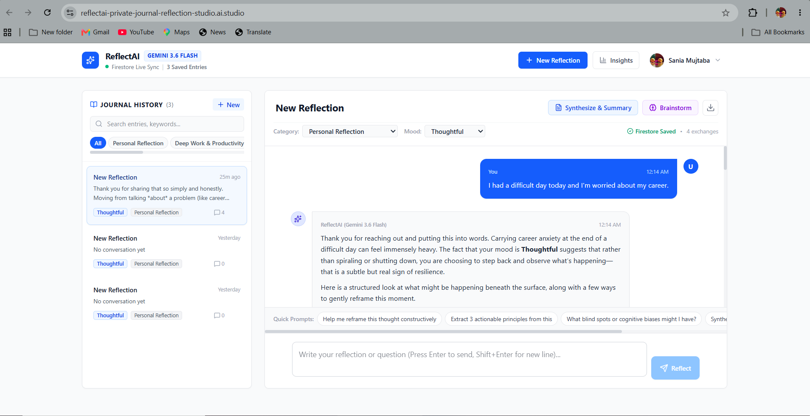

<div align="center">

# 🧠 ReflectAI — Private Journal & Reflection Studio


<br/><br/>

<a href="https://reflectai-private-journal-reflection-studio-whk6ntrabq-as.a.run.app">

</a>

<a href="https://github.com/sania28/reflectai-private-journal">

</a>

<br/><br/>


</div>

---

## 🧠 About the Project

**ReflectAI — Private Journal & Reflection Studio** is an AI-powered private journaling application designed to help users reflect on their thoughts through meaningful, personalized, multi-turn conversations.

ReflectAI combines **Gemini AI, Firebase Authentication, Cloud Firestore, Google Cloud Secret Manager, and Google Cloud Run** to deliver a secure and scalable reflection experience.

Users can create journal entries, interact with an AI reflection companion, explore summaries and insights, and maintain their personal reflections in a private user-isolated environment.

> **Reflect. Understand. Grow. ✨**

---

## ✨ Features

<table>
<tr>
<td width="50%">

### 🤖 AI Reflection

* Gemini-powered conversations
* Multi-turn interaction
* Context-aware responses
* Reflection prompts
* Personalized insights

</td>
<td width="50%">

### 🔐 Privacy & Security

* Firebase Authentication
* User-isolated Firestore data
* Firestore security rules
* Secure secret management
* Protected application credentials

</td>
</tr>

<tr>
<td width="50%">

### 📔 Private Journal

* Create journal entries
* Reflection history
* Personal dashboard
* Organized entries
* Persistent cloud storage

</td>
<td width="50%">

### 📊 AI Insights

* Reflection summaries
* AI-generated insights
* Thought pattern exploration
* Brainstorming support
* Interactive insight views

</td>
</tr>
</table>

---

## 🧠 How It Works

```text
                         👤 USER
                           │
                           ▼
                ┌─────────────────────┐
                │   ReflectAI Web UI  │
                │   React + TypeScript│
                └──────────┬──────────┘
                           │
                           ▼
                ┌─────────────────────┐
                │ Firebase            │
                │ Authentication      │
                └──────────┬──────────┘
                           │
                           ▼
                ┌─────────────────────┐
                │ Google Cloud Run     │
                │ Application Server   │
                └──────────┬──────────┘
                           │
                 ┌─────────┴─────────┐
                 │                   │
                 ▼                   ▼
        ┌─────────────────┐   ┌─────────────────┐
        │    Gemini AI    │   │ Cloud Firestore │
        │                 │   │                 │
        │ Multi-turn      │   │ User-isolated   │
        │ Reflection      │   │ Journal Data    │
        └────────┬────────┘   └────────┬────────┘
                 │                     │
                 └──────────┬──────────┘
                            ▼
                   ✨ PERSONALIZED
                      REFLECTION
```

---

## 💬 Example Interaction

**User**

> 🗣️ I've been feeling overwhelmed with everything I need to accomplish.

**ReflectAI**

> ✨ It sounds like you may be carrying several responsibilities at once. Let's slow things down and identify what feels most important right now.

The conversation continues through **multi-turn interaction**, allowing the AI to maintain conversational context.

---

## ✨ Gemini AI Integration

Gemini powers the conversational intelligence behind ReflectAI.

It is used for:

* Natural-language understanding
* Multi-turn conversations
* Reflection prompts
* Contextual responses
* Journal summaries
* Insight generation
* Brainstorming assistance

The goal is to provide a **thoughtful reflection companion**, rather than simply generating generic responses.

---

## 🔥 Firebase & Firestore

### 🔐 Firebase Authentication

Firebase Authentication provides secure user authentication and establishes the identity used throughout the application.

### 🗄️ Cloud Firestore

Cloud Firestore provides persistent storage for journal entries and reflection data.

User data is isolated so authenticated users can access their own journal information.

```text
Firebase Authentication
          │
          ▼
     User Identity
          │
          ▼
    Cloud Firestore
          │
     ┌────┼────┐
     ▼    ▼    ▼
   User A User B User C
   Private Private Private
   Data    Data    Data
```

Firestore security rules help enforce user-specific access to stored data.

---

## 🔑 Secure Secret Management

Sensitive configuration and API credentials are kept outside the public source code.

The application architecture uses **Google Cloud Secret Manager** for secure handling of application secrets.

Never commit:

```text
.env
API keys
Passwords
Private keys
Service-account credentials
```

The repository contains only `.env.example` for configuration reference.

---

## ☁️ Google Cloud Run

ReflectAI is deployed as a production web application on **Google Cloud Run**.

### Deployment Highlights

* Serverless container deployment
* Managed infrastructure
* HTTPS endpoint
* Automatic scaling
* Google Cloud integration
* Production-ready hosting

### Production Region

```text
asia-southeast1
```

### Live Cloud Run Application

```text
https://reflectai-private-journal-reflection-studio-whk6ntrabq-as.a.run.app
```

---

## 🛠️ Tech Stack

<div align="center">

|           Technology           | Purpose                       |
| :----------------------------: | :---------------------------- |
|          ⚛️ **React**          | Frontend application          |
|        📘 **TypeScript**       | Type-safe development         |
|          ✨ **Gemini**          | AI-powered reflection         |
| 🔥 **Firebase Authentication** | Secure user authentication    |
|     🗄️ **Cloud Firestore**    | User-isolated journal storage |
|     ☁️ **Google Cloud Run**    | Production deployment         |
|      🔑 **Secret Manager**     | Secure secret management      |
|           ⚡ **Vite**           | Frontend tooling              |
|         🟨 **Node.js**         | Application runtime           |

</div>

---

## 📂 Project Structure

```text
reflectai-private-journal/
│
├── 📁 assets/
│   └── reflectai-preview.png
│
├── 📁 src/
│   ├── 📁 components/
│   │   ├── AuthLandingPage.tsx
│   │   ├── BrainstormModal.tsx
│   │   ├── DashboardHeader.tsx
│   │   ├── EntriesSidebar.tsx
│   │   ├── ReflectionStudio.tsx
│   │   ├── StatsModal.tsx
│   │   └── SummaryInsightsModal.tsx
│   │
│   ├── 📁 lib/
│   │   └── firebase.ts
│   │
│   ├── App.tsx
│   ├── index.css
│   ├── main.tsx
│   └── types.ts
│
├── 📄 server.ts
├── 📄 index.html
├── 📄 package.json
├── 📄 bun.lock
├── 📄 firestore.rules
├── 📄 firebase-applet-config.json
├── 📄 firebase-blueprint.json
├── 📄 tsconfig.json
├── 📄 vite.config.ts
├── 📄 .env.example
├── 📄 .gitignore
└── 📖 README.md
```

---

## 📸 Application Preview

<div align="center">



<br/><br/>

### ReflectAI — Private Journal & Reflection Studio

*Private AI-powered journaling with personalized multi-turn reflection.*

</div>

---

## 🚀 Run Locally

### Clone Repository

```bash
git clone https://github.com/sania28/reflectai-private-journal.git
cd reflectai-private-journal
```

### Install Dependencies

Using Bun:

```bash
bun install
```

Or using npm:

```bash
npm install
```

### Environment Configuration

Create a local `.env` file using `.env.example` as a reference.

```bash
cp .env.example .env
```

Add the required configuration locally.

**Never commit `.env` to GitHub.**

### Start Development Server

```bash
npm run dev
```

---

## 🌐 Live Application

<div align="center">

### ✨ Experience ReflectAI

<a href="https://reflectai-private-journal-reflection-studio-whk6ntrabq-as.a.run.app">


</a>

<br/><br/>

**Reflect. Understand. Grow.**

<br/><br/>

<a href="https://reflectai-private-journal-reflection-studio-whk6ntrabq-as.a.run.app">
https://reflectai-private-journal-reflection-studio-whk6ntrabq-as.a.run.app
</a>

</div>

---

## 🎯 Ideathon Highlights

ReflectAI demonstrates how modern Google technologies can work together to build a production-ready AI application:

* ✨ Gemini-powered multi-turn AI
* 🔐 Firebase Authentication
* 🔥 User-isolated Cloud Firestore
* ☁️ Google Cloud Run
* 🔑 Google Cloud Secret Manager
* ⚛️ React + TypeScript
* 📔 AI-assisted private journaling
* 🧠 AI-generated reflection and insights
* 🛡️ Firestore security rules
* 🚀 Production cloud deployment

---

## 🏆 What This Project Demonstrates

```text
       👤 USER
          │
          ▼
   Firebase Auth
          │
          ▼
      ReflectAI
          │
     ┌────┴────┐
     ▼         ▼
  Gemini    Firestore
     │         │
     └────┬────┘
          ▼
      Cloud Run
          │
          ▼
     🌐 LIVE APP
```

### Authentication + AI + Persistent Data + Cloud Deployment

A complete user-focused AI application built using modern Google Cloud technologies.

---

## 👩‍💻 Author

<div align="center">

### Sania Mujtaba

**B.Tech — Computer Science & Engineering**

<a href="https://github.com/sania28">

</a>

<br/><br/>

⭐ **If you like this project, consider giving it a star!**

<br/><br/>

✨ *Reflect. Understand. Grow.*

</div>

---

<div align="center">

### 🧠 Built with AI. Designed for Reflection. Deployed on Google Cloud.

**Gemini • Firebase • Firestore • Secret Manager • Cloud Run**

</div>
